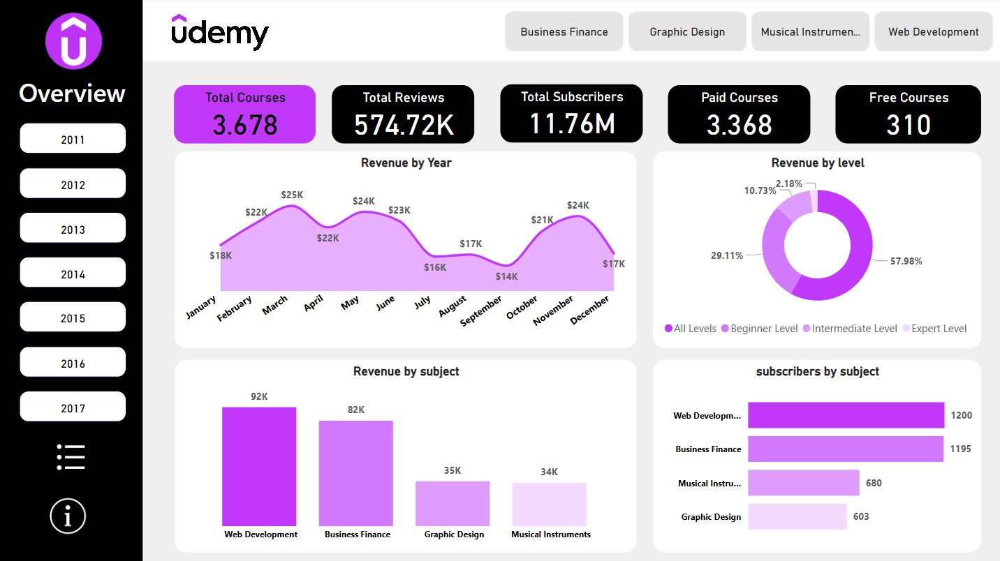
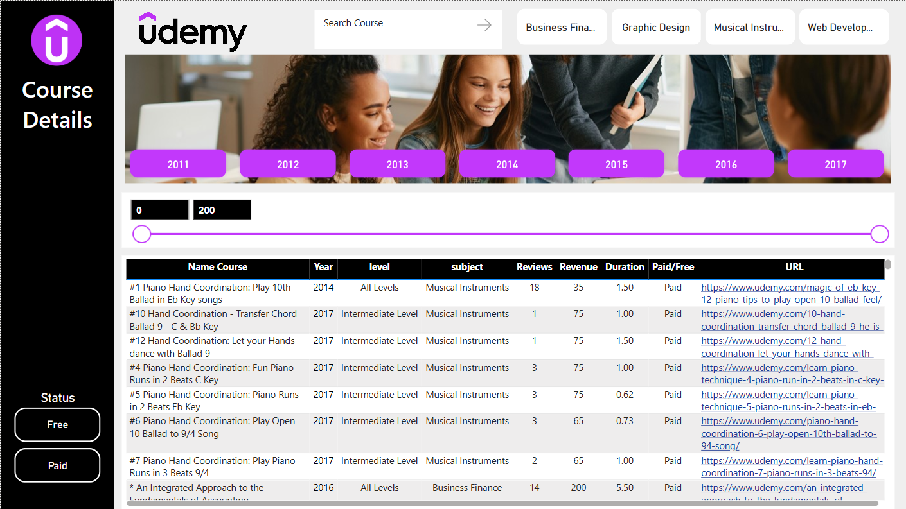

# Udemy Courses 📚

# Description

A comprehensive analysis of Udemy courses using Power BI, featuring an interactive dashboard to explore revenue, reviews, and subscriber counts by year, level, and subject. This project helps uncover key trends and understand course performance based on real data.

# Tools:

- Power Query power query data cleaning

- DAX : For data preparation, calculations, and measures.
  
- Power BI: For interactive dashboards and data visualization.

# Overview Dashboard

The Overview Dashboard provides a high-level summary of Udemy course data, giving quick insights into key metrics and performance indicators.

# Key Metrics:

- 📚 Total Courses: Number of available courses (paid and free).

- ⭐ Total Reviews: Total count of user reviews across all courses.

- 👥 Total Subscribers: Total number of students enrolled in courses.

- 💲 Paid vs Free Courses: Breakdown of paid and free course offerings.

# Visual Insights:

- Revenue by Year: A line chart showing revenue growth over time.

- Revenue by Level: A donut chart breaking down revenue by course difficulty (Beginner, Intermediate, Expert, etc.).

- Revenue by Subject: Bar chart highlighting revenue distribution across different subjects (e.g., Web Development, Business Finance).

- Subscribers by Subject: Horizontal bar chart displaying subscriber counts by subject area.

# Purpose:
This dashboard helps instructors, content creators, and business analysts quickly understand course performance, identify growth opportunities, and make data-driven decisions for platform optimization.

# Course Details Dashboard

The Course Details Dashboard provides a detailed view of individual Udemy courses, allowing users to dive deeper into specific course performance and attributes.

# Key Features:
- 📅 Course Timeline: Interactive timeline to filter courses by year of release.

- 🔍 Search & Filter: Search bar and slider to filter courses by review count or other attributes.

- 🧠 Course Level Breakdown: Information on course difficulty (All Levels, Beginner, Intermediate, Expert).

- 💸 Paid vs Free Courses: Clear distinction between paid and free courses.

# Data Table Insights:

- Course Name: Full course title with a direct link to the Udemy course page.

- Year: The year the course was published.

- Subject: Course category (e.g., Business Finance, Web Development, Musical Instruments).

- Reviews: Total number of reviews received.

- Revenue: Course revenue generated.

- Duration: Course length in hours.

# Purpose:

This dashboard is perfect for detailed course analysis, helping instructors and analysts understand which courses are performing best, track trends over time, and identify areas for improvement or new content opportunities.

# Conclusion

This Power BI project offers valuable insights into Udemy’s course performance, helping users make informed decisions based on real data. The combination of the Overview Dashboard and the Course Details Dashboard provides both a high-level summary and in-depth course analysis, making it easy to spot trends, understand subscriber behavior, and evaluate revenue streams.

By visualizing key metrics like revenue, reviews, and subscriber counts, content creators, instructors, and business analysts can:

- 📈 Identify growth opportunities by analyzing high-performing subjects and course levels.

- 🎯 Refine content strategies to better align with market demand and learner preferences.

- 💡 Optimize course offerings by balancing free and paid content based on performance data.

This project highlights the power of data visualization in transforming raw data into actionable insights, demonstrating how platforms like Udemy can leverage analytics to enhance their educational offerings and drive continuous improvement.

